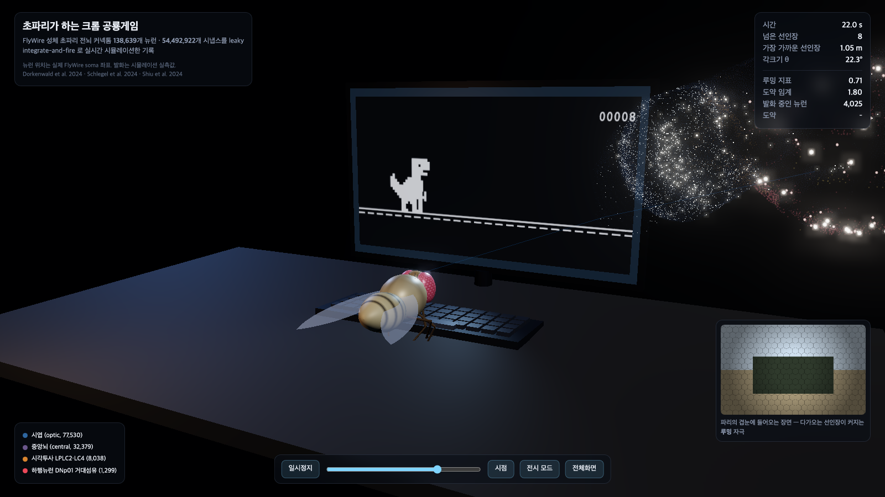

# flybrain — 초파리 전뇌 커넥톰 시뮬레이터 + 가상 세계

**초파리 뇌 전체를 실시간으로 돌려서 크롬 공룡게임을 하게 했다.**



FlyWire 성체 초파리 전뇌 커넥톰(뉴런 138,639개, 시냅스 5,449만 개)을 그대로 배선한
leaky integrate-and-fire 네트워크가 화면을 보고 스페이스바를 누른다. 생물 시간 1초 =
벽시계 1초로 돈다.

| 조건 (6 시행 × 20초) | 생존 평균 | 넘은 선인장 | 완주 |
|---|---|---|---|
| **정상(시각)** | **17.9초** | **6.5개** | **5/6** |
| 맹목 — 게임은 돌되 균일 회색만 보여줌 | 2.85초 | 0개 | 0/6 |
| R1-6 광수용체 침묵 | 2.85초 | 0개 | 0/6 |

시각화는 [`web/`](web/) 에 있다. 뇌 점구름의 위치는 실제 FlyWire soma 좌표이고,
점이 밝아지는 순간은 시뮬레이션에서 그 뉴런이 실제로 발화한 시점이다.
전시 모드(해설 + 자동 시점 전환)는 `?kiosk=1` 로 연다.

---


FlyWire 성체 초파리 전뇌 커넥톰(v783: 뉴런 138,639개, 연결 1,509만 개, 시냅스 5,449만 개)을
그대로 배선한 leaky integrate-and-fire(LIF) 네트워크를 돌리고, 2차원 가상 아레나 속 초파리 몸과
폐회로로 연결해 실험하는 환경이다.

```
가상 세계 ──감각(냄새·맛·빛·온도·바람·접촉)──▶ 감각 뉴런 Poisson 자극
     ▲                                              │
     │                                   전뇌 LIF (138,639 뉴런, 0.1 ms 스텝)
     │                                              │
     └──── 걷기·회전·주둥이 신전·도약 ◀── 하행/운동 뉴런 발화율 (50 ms마다)
```

## 설치와 첫 실행

```bash
cd ~/초파리
uv sync --extra dev          # 의존성 (numpy, scipy, pandas, pyarrow, matplotlib)
uv run flybrain setup        # 데이터 내려받기(약 135 MB) + 캐시 생성
uv run flybrain validate     # 원 논문 결과 재현 확인 (당 GRN → MN9)
uv run pytest                # 테스트 13개
```

Brian2 는 필요 없다. 엔진은 numpy/scipy 로 새로 작성했고, 원 Brian2 모델과 같은 결과를 낸다(아래 "검증").

속도는 엔진에 따라 다르다 (Apple M5 실측, 생물 시간 1초당 벽시계 시간):

| 엔진 | 무자극 | 광수용체 7,932개 @ 300 Hz |
|---|---|---|
| `lif_mlx.MLXLIFNetwork` (Metal GPU) | 0.50초 | 0.46초 — **실시간의 2.2배** |
| `lif.LIFNetwork` (numpy, 1코어) | 2.17초 | 더 느림 |

GPU 엔진은 RTF 이 발화량과 거의 무관하다(전달 커널 비용이 스파이크 수가 아니라 전체 시냅스
수에 지배된다). 단 `run(eval_every=)` 은 64 이상이어야 한다 — 1 이면 커널 launch 오버헤드로
5배 느려진다.

## 실험하는 법

### 1. 가상 세계 폐회로 실험

```bash
uv run flybrain run feeding --duration 30      # 당/쓴맛 패치가 있는 먹이 아레나
uv run flybrain run wind --duration 4          # 2초에 바람 → 탈출 도약
uv run flybrain run odor --odorant vinegar --duration 20
uv run flybrain run thermal | touch | looming
```

결과는 `results/` 에 저장된다.
- `<이름>.html` 은 브라우저에서 여는 재생기다. 궤적과 하행 뉴런 발화율을 시간에 맞춰 보여 준다.
- `<이름>.png` 는 궤적과 시계열 요약 그림이다.
- `<이름>_trajectory.csv` 는 50 ms 간격의 위치, 속도, 뉴런 그룹 발화율, 감각 입력 기록이다.

유전학 실험처럼 뉴런을 끄거나 켤 수 있다.

```bash
# MN9 를 억제한 채 먹이 실험 (섭식이 사라지는지)
uv run flybrain run feeding --silence-type CB0701 --name feeding_MN9_off
# 후진 뉴런 MDN 을 지속 활성화 (moonwalker 실험)
uv run flybrain run feeding --excite-type MDN --name feeding_MDN_on
```

### 2. 크롬 공룡게임 (실시간 시각 폐회로)

```bash
uv run flybrain dino --duration 30                          # 실시간 1회 (벽시계 30초)
uv run flybrain dino --duration 20 --trials 6 --controls    # 대조군 포함 배터리
```

공룡 1인칭 시점을 파리 눈에 투영한다. 다가오는 선인장은 각크기가 커지는 루밍 자극이 되고,
루밍은 실제 초파리에서 도피 도약을 일으키는 자연 유발자극이다. 60 fps 로 생물 시간과
벽시계를 맞추며 돌고, 프레임 예산 16.67 ms 대비 작업은 p50 12~15 ms 다.

| 조건 (6 시행 × 20초) | 생존 평균 | 넘은 선인장 | 완주 |
|---|---|---|---|
| **정상(시각)** | **17.9초** | **6.5개** | **5/6** |
| 맹목 — 게임은 돌되 균일 회색만 보여줌 | 2.85초 | 0개 | 0/6 |
| R1-6 광수용체 침묵 | 2.85초 | 0개 | 0/6 |

도약은 **시엽 집단 활동을 읽는 디코더**에서 나온다(중심 25° 라미나 − 주변 35~75° 라미나).
교과서 경로인 LPLC2 → DNp01(거대섬유)이 아니다 — 그 경로가 이 모델에서 왜 작동하지 않는지는
`PLAN_realtime_dino.md` 에 측정과 함께 적었다.

### 3. 개방회로 활성화 실험 (Shiu et al. 2024 방식)

```bash
uv run flybrain activate --group sugar --side left --trials 10
uv run flybrain activate --type ORN_DA2 --preset curated
uv run flybrain activate --group sugar --silence-type CB0248     # 중간 뉴런 억제 효과
uv run flybrain search "^DNp0"                                      # 뉴런 찾기
uv run flybrain info                                                # 감각/운동 그룹 목록
```

### 4. 파이썬에서 직접

```python
from flybrain import *
from flybrain.world import Patch, OdorSource, TimedStimulus

world = World(width=100, height=100, fly=Fly(x=20, y=50),
              patches=[Patch(60, 50, radius=8, kind="sugar")],
              odor_sources=[OdorSource(80, 80, odorant="yeast")],
              events=[TimedStimulus("wind", 5.0, 5.5, side="left")])
exp = ClosedLoopExperiment(world, preset="curated", seed=1)
df = exp.run(10.0)                       # pandas DataFrame 궤적

from flybrain.plots import report; from flybrain.replay import write_replay
report(df, world, "results/my.png"); write_replay(df, world, "results/my.html")

# 저수준: 임의의 뉴런 집합 자극/기록
cx = load_connectome(); atlas = Atlas(cx)
net = LIFNetwork(cx.W_pre)
net.stimulate(atlas.by_type("DNa02", side="left"), 100)
net.run(500); rates = net.rates()
```

세계 요소는 다음과 같다.
- `OdorSource` 는 냄새 원천이다. 가우시안 플룸이 사구체별 ORN 을 자극하며, 좌우 안테나 농도 차이를 쓴다. 냄새 프로파일은 `atlas.ODORANTS` 에 있고 사구체 딕셔너리로 직접 줄 수도 있다.
- `Patch` 는 바닥의 맛 자극이다. 종류는 sugar, bitter, salt_low, water 가 있다.
- `LightField`, `ThermalZone`, `WindField` 는 빛, 온도, 바람 필드다.
- `TimedStimulus` 는 시간 구간 동안 채널을 켠다. 채널은 wind, sound, touch_head, looming 등이다.
- `Fly.satiety_capacity` 는 배고픔을 정한다. 먹을수록 당 감각 이득이 줄어든다.

## 모델

뉴런 방정식과 상수는 Shiu et al. 2024 (Nature 634:210) 와 같다.

| 항목 | 값 |
|---|---|
| 휴지/리셋 전위, 역치 | −52 mV, −52 mV, −45 mV |
| 막 시정수 / 시냅스 시정수 | 20 ms / 5 ms |
| 불응기 / 시냅스 지연 | 2.2 ms / 1.8 ms |
| 시냅스 1개당 가중치 | 0.275 mV |
| 적분 | 0.1 ms, 정확해 (선형 ODE) |

### 가중치 프리셋

- **`shiu2024`** 는 원 모델 그대로다. 부호는 FlyWire 신경전달물질 예측을 따른다. ACh, DA, 5HT, OA 는 흥분이고 GABA, Glu 는 억제다. `activate` 명령의 기본값이다.
- **`curated`** 는 폐회로의 기본값이다. 원 모델에서는 후각이나 온도 입력이 무엇이든 더듬이엽 국소뉴런 루프가 점화된다. 그러면 수천 개 뉴런이 자극 종료 뒤에도 ~280 Hz 로 발화하고, 모든 냄새가 같은 반응이 된다. 보정은 세 가지다.
  1. 신경전달물질은 문헌 기반 `known_nt` 를 먼저 쓰고, 없으면 같은 cell_type 의 신뢰도 가중 다수결, 그다음 예측값을 쓴다. 뉴런 22,054개의 전달물질이 바뀐다.
  2. 모노아민(DA, 5HT, OA)은 빠른 시냅스 효과를 0 으로 둔다.
  3. 흥분성 국소뉴런 lLN1 의 화학 시냅스 출력을 0 으로 둔다. 이 뉴런들은 주로 전기 시냅스로 작동하는데 모델에는 전기 시냅스가 없다.

  이 보정으로 geosmin, cVA, 쓴맛, 냉각 입력이 서로 구별되는 반응을 낸다. 당 → MN9 경로는 그대로 유지된다.

`LIFParams(stp_U=..., adapt_inc=...)` 로 단기 시냅스 억압과 적응 전류를 켤 수도 있다. 둘 다 원 모델에는 없다.

### 뇌-몸 인터페이스

| 감각 채널 | 뉴런 (FlyWire 주석) |
|---|---|
| 냄새 | ORN_<사구체> 53종, 2,279개 |
| 당 / 쓴맛 / 저염 | gustatory sugar/water 129, bitter 65, low-salt 19 |
| 빛 | R1-6 광수용체 (30% 표본) |
| 열 / 냉 / 건조 / 습 | TRN_VP2, TRN_VP3, HRN_VP4, HRN_VP5 |
| 바람 / 소리 / 접촉 | Johnston 기관 wind_gravity, auditory, 머리 강모 |

| 운동 출력 | 하행/운동 뉴런 |
|---|---|
| 전진 | DNp09, DNa01 |
| 회전 (좌−우 차) | DNa01, DNa02, DNa03 |
| 후진 | MDN |
| 도약 | DNp01 (giant fiber), DNp11, DNp07, DNp10 |
| 주둥이 신전/섭식 | MN9 (CB0701), 섭식 운동뉴런 |

몸 규칙도 있다. 뇌 모델에 없는 부분을 몸 쪽에서 보충하는 것으로, `MotorDecoder` 에서 끄거나 바꿀 수 있다.
- 자발 보행은 5 mm/s 에 지속성 있는 회전 잡음을 더한 것이다. 모델에는 보행 리듬 생성기(CPG)가 없다.
- 먹는 동안에는 멈춘다.
- 도약 뒤 1초 동안은 다시 도약하지 않는다.
- 배고픔이 당 이득을 조절한다.

## 검증

Shiu et al. 원 코드(`reference/shiu_model.py`)를 Brian2 2.9 로 v783 데이터에서 돌린 결과와 비교했다.
자극은 당 GRN 20개, 150 Hz, 1초다.

| 지표 | Brian2 원본 | flybrain |
|---|---|---|
| 발화한 뉴런 수 | 413 | 407 |
| 비자극 뉴런 발화율 상관 | – | r = 0.9988 (기울기 0.98) |
| MN9 (오른쪽) | 79.5 Hz | 77.6 Hz |
| MN9 (왼쪽) | 60.8 Hz | 57.9 Hz |
| 1초 시행 계산 시간 | ~90 s (4코어) | ~5 s (1코어) |

작은 네트워크의 PSP 파형, Poisson 구동, 수렴 입력 반응도 Brian2 와 비교했다(`tests/test_lif.py`).
Brian2 와 일치시키려면 한 가지가 중요했다. 변수 `g` 는 `(unless refractory)` 이므로, 불응기 중 도착한 시냅스 입력은 버려야 한다.

## 예시 결과 (`bash examples/run_all.sh`)

| 실험 | 결과 |
|---|---|
| 먹이 아레나 30초 | 당 패치에서 MN9 가 ~100 Hz 로 발화해 주둥이를 내밀고 약 2초간 먹은 뒤, 배가 불러 다시 걷는다 |
| 같은 실험 + MN9 억제 | 당 패치를 지나가도 섭식 0 |
| 배고픈 파리, 패치 위 3초 (3 seed 평균) | 아래 표 |
| 바람 퍼프 | 바람 0.5초 동안 giant fiber 계열이 ~10 Hz 로 발화해 도약 1회 |
| 식초 냄새 | 원천 근처에서 회전 DN 이 발화하지만 원천을 향한 조향은 나타나지 않음 (한계 참고) |

| 조건 | 주둥이 신전 비율 | MN9 (Hz) |
|---|---|---|
| 당 | 1.00 | 90 |
| 당 + 쓴맛 | 0.93 | 52 |
| 쓴맛 | 0 | 0 |
| 당 + MN9 억제 | 0 | 0 |

쓴맛은 당이 일으키는 MN9 반응을 약 40% 줄인다. 억제의 방향은 Shiu et al. 과 같다.

## 알려진 한계

- **후각 조향**은 이 모델에서 좌우 대칭이 아니다. 냄새가 어느 쪽에서 오든 주로 왼쪽 회전 DN(DNa02)이 반응한다. 그래서 냄새 원천을 향해 가는 행동은 기대하기 어렵다. 이것은 모델의 결과이며, 디코더에서 억지로 보정하지 않았다.
- **보행 DN** 은 대부분의 감각 입력에서 거의 발화하지 않는다. 걷기는 대부분 몸 규칙인 자발 보행에서 나온다.
- **시각**: 망막지도를 복구해 화면을 광수용체에 투영하면 시엽이 실제로 반응한다(`flybrain/retina.py`).
  커넥톰에는 T4/T5 의 HRC 공간 offset 도 들어 있다 — 해부학만으로 T4a/b 가 방위각 축에서,
  T4c/d 가 고도 축에서 서로 반대 방향 offset 을 갖는 것이 확인된다(Maisak 2013 과 일치).
  그런데도 **방향 선택성은 나오지 않는다**(뉴런별 \|DSI\| 중앙값 0.002, 실제 파리는 0.5~0.9).
  모든 뉴런이 같은 시정수(막 20 ms, 시냅스 5 ms)와 같은 시냅스 지연(1.8 ms)을 쓰고 억제가
  전류 기반 감산 억제여서, HRC 가 요구하는 시간 비대칭과 곱셈적 결합이 없기 때문이다.
  시정수 풀 2개, 분할(shunting) 억제, 등급전위 rate 모델을 각각 시험했지만 모두 DSI ≈ 0 이었다.
  결과적으로 **LPLC2 는 침묵이고 DNp01 은 자극과 무관하게 34~47 Hz 로 발화한다**.
  루밍 기반 도약은 이 때문에 거대섬유 경로가 아니라 시엽 집단 신호로 읽는다.
- 시엽 컬럼 뉴런 대부분(L1~L5, Mi, Tm, Dm, CT1)은 원래 스파이크를 내지 않는 **등급전위**
  뉴런이다. 스파이킹 LIF 로 근사하려면 동작점을 역치 근처에 두어야 해서
  `VisualBrain` 이 시엽 내재뉴런 77,530개에 뉴런별 지속 전류를 항상성 보정으로 넣는다.
  이 보정은 경로를 살리지만 하류에 배경 범람을 만든다.
- 전기 시냅스, 신경조절, 가소성, 뉴런별 형태 차이는 모델에 없다. 모든 뉴런이 같은 LIF 이고 가중치는 시냅스 수에 비례한다.
- 가장 믿을 만한 것은 Shiu 등이 실험으로 검증한 미각-섭식 회로(당, 쓴맛, 물 → MN9)와 같은 피드포워드 감각운동 경로다.

## 데이터 출처와 인용

- Dorkenwald et al. 2024, *Neuronal wiring diagram of an adult brain*, Nature 634:124 (FlyWire)
- Schlegel et al. 2024, *Whole-brain annotation and multi-connectome cell typing*, Nature 634:139 (주석)
- Eckstein et al. 2024, *Neurotransmitter classification from electron microscopy images*, Cell (전달물질 예측)
- Shiu et al. 2024, *A Drosophila computational brain model reveals sensorimotor processing*, Nature 634:210
  (연결표 `Connectivity_783.parquet`, 모델 상수) — github.com/philshiu/Drosophila_brain_model

FlyWire 데이터는 CC-BY 4.0 이다. 논문에 쓸 때는 위 논문들을 인용한다.

## 파일 구조

```
flybrain/
  config.py      경로, 다운로드 URL
  data.py        커넥톰 로딩/캐시, 전달물질 보정, 가중치 프리셋
  atlas.py       뉴런 검색, 감각/운동 그룹, 냄새 프로파일
  lif.py         LIF 엔진 (numpy/scipy.sparse)
  lif_mlx.py     LIF 엔진 (Apple Metal GPU) — 실시간용. 시냅스 풀 2개, 뉴런별 지속 전류
  retina.py      망막지도 복구 (R1-6 → 라미나 → Mi1 컬럼), 화면 → 광수용체 인코더
  visual.py      시각 자극 장면 (드리프트 격자, 루밍 원, 점멸 대조군)
  realtime.py    실시간 시각 폐회로 (VisualBrain, 작동점 보정, 프레임 시계/slip 통계)
  dino.py        크롬 공룡게임 물리 + 1인칭 렌더링 + 도약 디코더
  dino_run.py    게임 폐회로 실행기 (맹목/침묵 대조군 포함)
  dino_replay.py 게임 기록 → HTML 재생기
  world.py       2D 아레나, 초파리 몸, 자극
  interface.py   감각 인코더 / 운동 디코더
  experiment.py  개방회로·폐회로 실험 러너
  scenarios.py   미리 만든 시나리오
  plots.py, replay.py   그림, HTML 재생기
  cli.py         flybrain 명령
reference/       Shiu et al. 원본 코드 (MIT)
tests/           단위/통합 테스트
data/raw, data/cache, results/   (git 제외)
```
